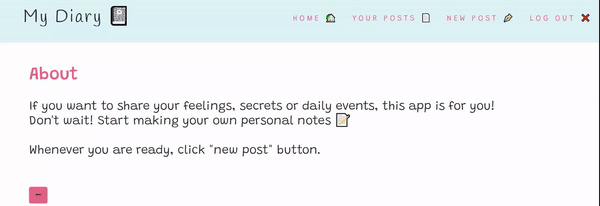

# My Diary

> My Diary is an apllication where you can make your own personal notes of daily events, feelings and secrets 📖

## Table of contents

- [Technologies](#technologies)
- [Setup](#setup)
- [Features](#features)
- [Inspiration](#inspiration)

## Technologies

- JavaScript ES6
- Bootstrap - version 4.0
- Node Js - version 14.8.0
- Express Js - version 4.17.1
- MongoDB - version 4.2.8

## Setup

Downolad folder and add your own env file to connect with MongoDB.

To run this project install it locally using npm:

- cd.../MyDiary
- npm install
- npm start

## Features

- Register/login to app
- Add your own personal notes ✏️
- Edit your posts 
- Delete your posts using 🗑️
- Use it on your 💻 or 📱

## Inspiration

This app is inspired by Angela Yu (https://www.udemy.com/course/the-complete-web-development-bootcamp/) and Traversy Media (https://www.youtube.com/watch?v=SBvmnHTQIPY).
